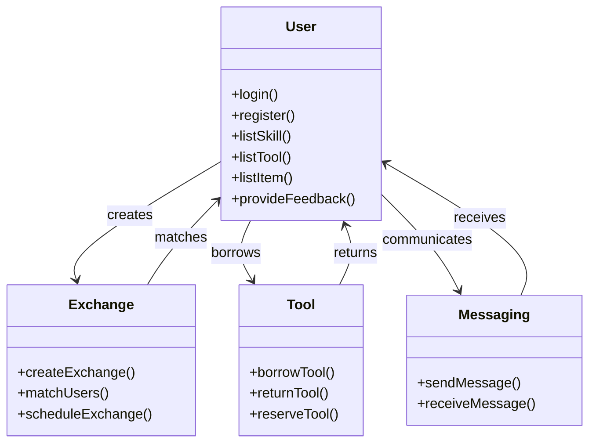

# Project: e-Sharevice

## Overview

**e-Sharevice** is a React-based application designed to facilitate the exchange of skills, tools, and unused items within a community. By leveraging modern technology, the app aims to foster stronger community bonds, reduce waste, and promote cost-effective living through shared resources.

## Project Goals

The primary goals of e-Sharevice are:

1. To connect neighbors for exchanging skills and services.
2. To create a community tool library where users can borrow tools and equipment.
3. To facilitate the exchange of unused items, reducing waste and unnecessary purchases.

## Problem Identification

Many communities lack a centralized platform for sharing skills, tools, and items, leading to underutilized resources and missed opportunities for cost savings and community engagement. e-Sharevice aims to address these issues by providing a convenient and user-friendly solution.

## Target Audience

The intended user base for e-Sharevice includes:

- Individuals looking to exchange skills and services within their community.
- Homeowners and DIY enthusiasts needing occasional access to tools.
- People looking to reduce waste by swapping unused items.

## User Needs and Features

### User Needs

The needs of the target users were identified through research and community feedback. Key needs include reliable matchmaking for exchanges, secure in-app communication, and a fair system for managing transactions.

### Feature List

1. **User Profiles**: Create and manage profiles listing skills, tools, and items available for exchange.
2. **Matchmaking**: Match users based on skill needs, tool requirements, and item availability.
3. **In-App Communication**: Messaging and scheduling functionality within the app.
4. **Reservation System**: Borrowing and reservation functionality for tools.

### Feature Prioritization

Features were prioritized based on their impact on user engagement and community benefits, with matchmaking, communication, and ratings being the top priorities.

## Implementation Details

### Tech Stack Choice

- **Frontend**: React for a responsive and modular user interface.
- **Backend**: Node.js and Express for robust server-side operations.
- **Database**: Knex and MySQL for managing user data, exchanges, and transactions.

### Client Libraries

- **React**: For building the user interface.
- **Axios**: For API calls and data handling.

### Server Libraries

- **Express**: For creating API endpoints.
- **Knex**: For database management.

### Security Measures

To ensure secure access and data management, the following measures were implemented:

- **JWT (JSON Web Tokens)**: For user authentication and authorization.
- **Data Encryption**: Protect user data in transit and storage.

### API and Endpoints

Endpoints are structured to handle user interactions, exchanges, and authentication:

- **POST /signup**: Register a new user.
- **POST /login**: Authenticate a user and provide a token.
- **POST /check-email**: Check if an email is already registered.
- **GET /current-user**: Retrieve the current authenticated user's information.
- **GET /sample-data**: Read and return data from the data.json file.
- **GET /exchange-items**: Retrieve all exchange items.
- **GET /exchange-items/:id**: Retrieve details of a specific exchange item by its ID.
- **POST /exchange-items**: Create a new exchange item (includes file upload for an image).
- **PUT /exchange-items/:id**: Update an existing exchange item by its ID (includes file upload for an image).
- **DELETE /exchange-items/:id**: Delete a specific exchange item by its ID.
- **PUT /exchange-items/:id/reserve**: Reserve a specific exchange item by its ID.

## Data Management

### Data Privacy

User data privacy is maintained through encryption and secure storage practices.

### Data Quality

Regular audits and validations ensure data accuracy and reliability.

### Nice to Have

- **Credit System**: Implement points or credits for fair exchange of services and items.
- **DIY Guides and Skill Learning**: Integrate project ideas and guides.
- **Community Ratings**: Users can rate and review each other after exchanges.
- **DIY Guides and Skill Learning**: Project ideas and guides for using tools and developing skills.
- **State Management**: Redux for managing the application state.

### Bug Fixes

Regular bug fixing and testing to ensure the stability and usability of the app.

# UML Diagram

Below is a Mermaid syntax UML diagram illustrating the basic structure of e-Sharevice.

